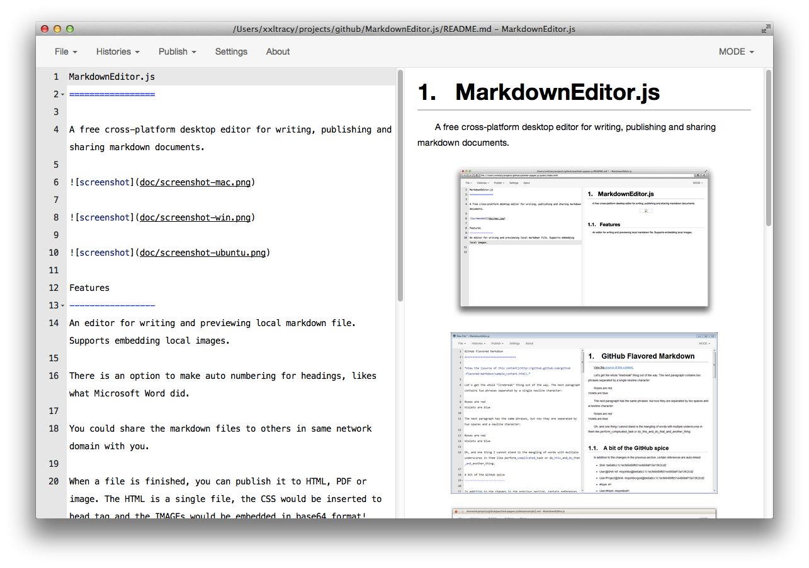
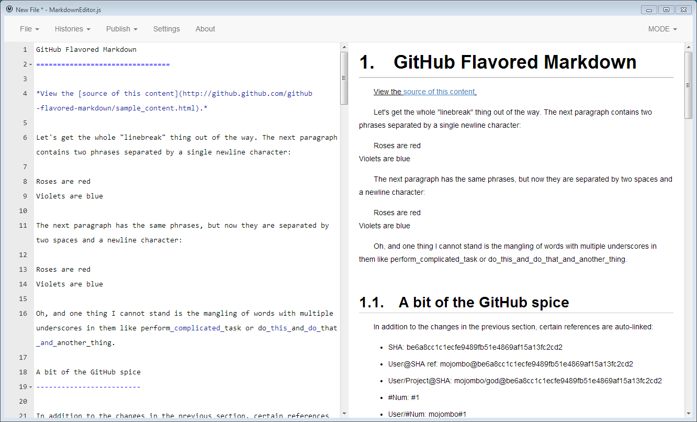
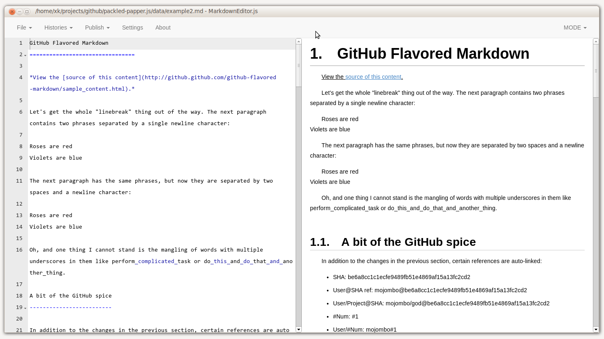

MarkdownEditor.js
=================

A free cross-platform desktop editor for writing, publishing and sharing markdown documents.

Current Version: 0.2.0 Preview

Downloads:

- [Windows](https://sourceforge.net/projects/markdowneditor-js/files/0.2.1/MarkdownEditor-win.zip/download)
- [MacOS](https://sourceforge.net/projects/markdowneditor-js/files/0.2.1/MarkdownEditor-mac.zip/download)
- [Linux32](https://sourceforge.net/projects/markdowneditor-js/files/0.2.1/MarkdownEditor-linux32.zip/download)
- [Linux64](https://sourceforge.net/projects/markdowneditor-js/files/0.2.1/MarkdownEditor-linux64.zip/download)

Features
-----------------
An editor for writing and previewing local markdown file. Supports embedding local images.

There is an option to make auto numbering for headings, likes what Microsoft Word did.

You could share the markdown files to others in same network domain with you.

When a file is finished, you can publish it to HTML, PDF or image. The HTML is a single file, the CSS would be inserted to head tag and the IMAGEs would be embedded in base64 format!

Shortcuts
-----------------
The editor is based on [ACE](http://ace.c9.io/), the default keymaps are:
- copy: mod+c
- paste: mod+v
- cut: mod+x
- find: mod+f

The shortcuts for "file" menu are:
- new: mod+n
- open: mod+o
- save: mod+s
- save as: mod+shift+s

TO BE CONTINUED
-----------------
The themes

The settings

Roadmap
-----------------
### 0.2.x
- 0.2.1: Bug fixing version
    - Fix all the visible bugs;
    - Changes setting effects dynamicly;
    - Auto zip built files to zip;
- 0.2.2: Provides markdown themes:
    - There are some predefined themes;
    - Every new file should use the default theme (github style);
    - Each file could be assigned a theme which will be saved in localStorage (max 100 files);
- 0.2.3: Better scrolling sync support
- 0.2.4: Adds tooltips for menu commands
- 0.2.5: Support file watching and file cache (for auto saving and resuming)
- 0.2.6: File associations with OS

### 0.3.x
- 0.3.0: TOC markdown extension
- 0.3.1: Table support, not a markdown extension

### More
- Supports sharing files in domain network.
- Supports editing pictures.
- Use diff to highlight differences between current content and histories;

Author
-----------------
ConstantineXue @weibo.com

License
-----------------
MIT